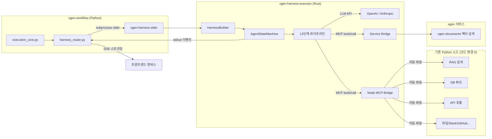
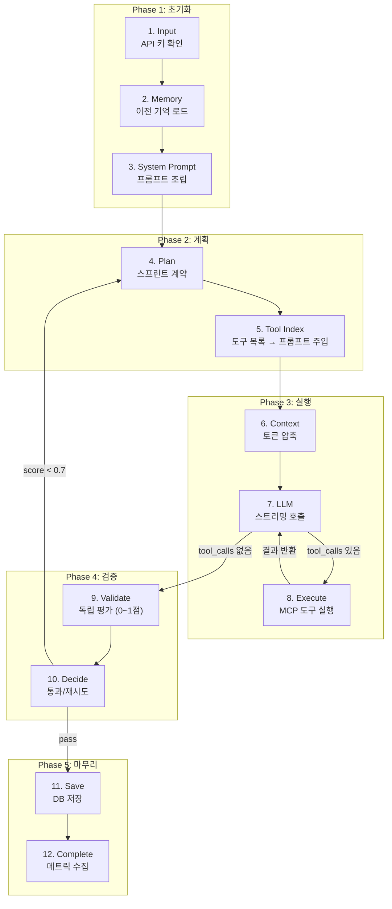
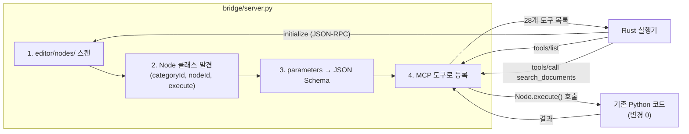

# xgen-harness-executor

> **한 줄 요약**: 사용자가 "이 문서 분석해줘"라고 하면, AI가 알아서 어떤 도구를 쓸지 판단하고, 실행하고, 결과를 검증하고, 부족하면 다시 한다.

Rust 상태 머신 기반 에이전트 실행기. Claude Code의 하네스 엔지니어링을 xgen 플랫폼에 이식했다.

---

## 이걸 왜 만들었나

기존 xgen-workflow에서는 사용자가 캔버스에서 노드를 직접 연결해야 했다.

```
기존: 사람이 설계한 대로만 실행
  [검색 노드] → [분석 노드] → [출력 노드]
  사람이 순서를 정해줘야 함. 빠뜨리면 안 됨. 틀려도 그냥 넘어감.

하네스: AI가 알아서 실행
  사용자: "이 데이터 분석해줘"
  AI: "먼저 문서를 검색하고... DB도 확인하고... 결과를 정리하면..."
  → 어떤 도구를 쓸지, 어떤 순서로 할지, AI가 스스로 판단
```

**핵심 차이:**
- 기존은 `for` 루프 — 한 번 돌고 끝. 틀려도 재시도 없음.
- 하네스는 `while` 루프 — 검증 실패하면 뒤로 돌아가서 다시 함.

---

## 이 프로젝트를 활용하는 3가지 방법

### 1. xgen-workflow 내장 (현재 사용 중)

xgen-workflow가 subprocess로 바이너리를 호출한다. 별도 서버 없이 **라이브러리처럼** 동작.

```
xgen-workflow (Python)
  └─ harness_router.py
       └─ subprocess: xgen-harness-stdio (Rust 바이너리)
            └─ stdin/stdout JSON-RPC 통신
```

Docker 안에서 Rust를 빌드하면 메모리 4~8GB를 먹어 OOM이 발생한다 (`lto=true` + `codegen-units=1`이 원인).
**로컬/CI에서 빌드 후 바이너리만 Docker에 COPY**하는 방식을 사용한다.

```dockerfile
# Dockerfile — COPY만, Rust 빌드 안 함
FROM debian:bookworm-slim
COPY target/release/xgen-harness-stdio /usr/local/bin/
```

### 2. Rust 라이브러리로 임베드

다른 Rust 서비스에서 라이브러리로 가져다 쓸 수 있다.

```toml
# Cargo.toml
[dependencies]
xgen-harness-executor = { path = ".", features = ["core"] }
```

```rust
use xgen_harness_executor::prelude::*;

// 가장 간단한 호출
let output = HarnessBuilder::new()
    .provider("anthropic", "claude-sonnet-4-6")
    .api_key("sk-...")
    .text("피보나치 함수 작성해줘")
    .run()
    .await?;

println!("{}", output["text"]);

// 이벤트 스트리밍 (실시간 진행 상황 수신)
let output = HarnessBuilder::new()
    .provider("openai", "gpt-4o")
    .text("데이터 분석해줘")
    .stages(["input", "system_prompt", "plan", "llm", "execute", "validate", "complete"])
    .tools(["mcp://bridge/nodes"])
    .run_with_events(|event| {
        println!("[{}] {:?}", event.event, event.data);
    })
    .await?;
```

### 3. 독립 HTTP 서버

Docker에서 독립 서비스로 실행할 수도 있다 (멀티에이전트 오케스트레이션용).

```bash
cargo build --release --features server --bin xgen-harness-executor
```

---

## 전체 아키텍처



### 통신 방식: subprocess + stdio JSON-RPC

```
Python (asyncio)                      Rust (tokio)
────────────────                      ────────────
proc = create_subprocess_exec(
  "xgen-harness-stdio",
  stdin=PIPE, stdout=PIPE)

stdin.write(JSON-RPC) ──────→         stdin 한 줄 읽기
stdin.close()                         → HarnessBuilder
                                      → AgentStateMachine.run()
                                      → 12단계 파이프라인 실행

  ←── stdout (라인별)     {"method":"harness/event",...}  실시간 이벤트
  ←── stdout (라인별)     {"method":"harness/event",...}
  ←── stdout (마지막)     {"id":1,"result":{"text":"..."}}  최종 결과
```

왜 HTTP가 아니라 subprocess인가?
- 프로세스 격리 — 크래시해도 workflow가 안 죽음
- 연결 비용 0 — 소켓 아니라 파이프
- 배포 간단 — 바이너리 하나 복사하면 끝

---

## 12단계 파이프라인



### 각 단계가 하는 일

| # | 단계 | 모듈 | 하는 일 | 왜 필요한가 |
|---|------|------|---------|------------|
| 1 | **Input** | `bootstrap.rs` | API 키 확인, provider/model 유효성 검증 | 키 없이 LLM 호출하면 비용만 날림 |
| 2 | **Memory** | `memory_read.rs` | 이전 실행 결과에서 관련 내용 프리페치 | 같은 질문 반복 시 이전 답변 참조 |
| 3 | **System Prompt** | `context_build.rs` | 에이전트 시스템 프롬프트 + 도구지침 + 환경정보 조립 | LLM이 자기 역할과 사용 가능한 도구를 알아야 함 |
| 4 | **Plan** | `plan.rs` | LLM에게 "먼저 계획을 세워라" 요청 (목표/전략/완료기준) | 계획 없이 바로 실행하면 삽질함. Validate의 채점 기준이 됨 |
| 5 | **Tool Index** | `tool_discovery.rs` | MCP 서버에서 도구 목록 가져와서 프롬프트에 주입 | LLM이 "메뉴판"을 봐야 주문할 수 있음 |
| 6 | **Context** | `context_compact.rs` | 토큰이 한도 넘으면 3단계 압축 (잘라내기→RAG축소→LLM요약) | 대화 길어지면 context window 터짐 |
| 7 | **LLM** | `llm_call.rs` | LLM API 스트리밍 호출. tool_calls 있으면 Execute로 | 핵심 두뇌 |
| 8 | **Execute** | `tool_execute.rs` | MCP 도구 실행 (Read=병렬, Write=직렬). 완료 후 LLM 복귀 | LLM이 "검색해줘"라고 하면 실제로 검색 |
| 9 | **Validate** | `validate.rs` | **별도 LLM**이 관련성·완전성·정확성·계약준수를 0~1점 채점 | 실행 LLM이 자기 답을 평가하면 편향됨 |
| 10 | **Decide** | `decide.rs` | 점수 0.7 미만이면 Plan으로 돌아가서 재시도 (최대 3회) | 한 번에 완벽한 답이 안 나올 수 있음 |
| 11 | **Save** | `memory_write.rs` | 실행 결과를 DB에 저장 | 다음에 Memory 단계에서 참조 |
| 12 | **Complete** | (내장) | 메트릭 수집 (소요시간, 토큰 수, 비용) | 운영 모니터링 |

### 프리셋 — 모든 단계를 다 돌 필요는 없다

| 프리셋 | 단계 | 언제 쓰나 |
|--------|:----:|-----------|
| `minimal` | 4개 | "안녕" 같은 단순 대화. 계획도 검증도 필요 없음 |
| `standard` | 7개 | "코드 작성해줘" 같은 도구 사용 작업 |
| `full` | 12개 | "RAG 검색 후 비교 보고서 작성" 같은 복잡한 작업 |

### 자동 바이패스 — "안녕"에 12단계를 돌리면 낭비

입력 복잡도를 규칙 기반(0ms, LLM 호출 없음)으로 판별:

```
"안녕"               → Simple   → full이어도 4단계로 다운그레이드
"CSV 분석해줘"       → Moderate → 7단계
"RAG 검색 후 보고서" → Complex  → 12단계 유지
```

---

## 기존 노드를 MCP로 감싸는 구조

### 왜 감싸나

기존 xgen-workflow에는 60+개 Python 노드가 있다 (RAG 검색, PostgreSQL, Slack, GitHub, API 호출 등). 이 노드들은 **DAG 실행기 전용**이라 LLM이 직접 호출할 수 없다.

하네스에서 이 노드들을 쓰려면 LLM이 호출할 수 있는 형태, 즉 **MCP 도구**로 변환해야 한다.

### 어떻게 감싸나: Node MCP Bridge

`bridge/server.py`가 기존 Python 노드를 **자동으로** MCP 도구로 변환한다. 기존 노드 코드를 한 줄도 수정하지 않는다.



### 변환 예시

기존 노드:
```python
class VectorDBContext(Node):
    nodeId = "document_loaders/VectorDBContext"
    parameters = [
        {"id": "query", "type": "STR", "required": True},
        {"id": "collection_name", "type": "STR"},
        {"id": "limit", "type": "INT", "value": 5},
    ]
    def execute(self, query, collection_name=None, limit=5):
        return self.search_vectors(query, collection_name, limit)
```

자동 변환된 MCP 도구:
```json
{
  "name": "node_document_loaders_VectorDBContext",
  "description": "벡터 DB에서 문서를 검색합니다",
  "inputSchema": {
    "type": "object",
    "properties": {
      "query": {"type": "string"},
      "collection_name": {"type": "string"},
      "limit": {"type": "integer", "default": 5}
    },
    "required": ["query"]
  }
}
```

LLM은 이 목록을 보고 "아, 벡터 검색 도구가 있네"하고 필요할 때 호출한다.

### MCP 도구 URI

| URI | 동작 | 언제 쓰나 |
|-----|------|-----------|
| `mcp://bridge/nodes` | 기존 Python 노드 전부 MCP 도구화 | 항상 (자동 주입) |
| `mcp://bridge/nodes?categories=rag,api` | 특정 카테고리만 | 도구를 제한하고 싶을 때 |
| `mcp://bridge/services` | xgen-documents API를 MCP 도구로 | 문서 검색이 필요할 때 |
| `mcp://session/SESSION_ID` | xgen-mcp-station 경유 | 외부 MCP 서버 |

### 제외되는 노드 — 감쌀 필요 없는 것들

| 제외 대상 | 이유 |
|-----------|------|
| `agents/*` | 하네스 자체가 에이전트 역할 |
| `startnode/*`, `endnode/*` | 하네스가 입출력을 직접 처리 |
| `router/*` | 하네스가 흐름을 자율적으로 제어 |
| `tools/agent_planner` | 하네스 Plan 단계가 동일한 역할 |

### Service Tools Bridge

`bridge/service_tools.py`는 xgen 서비스 간 API를 MCP 도구로 노출:

| 도구 | 설명 |
|------|------|
| `search_documents` | xgen-documents 벡터 검색 (쿼리 → 관련 문서 반환) |
| `list_collections` | 사용 가능한 컬렉션 목록 조회 |
| `search_in_collection` | 특정 컬렉션에서 검색 |

---

## Claude Code에서 가져온 것

### query.ts → 12단계 상태 머신

Claude Code의 핵심 루프(`query.ts`)를 분석해서 Rust로 포팅했다.

| Claude Code (query.ts) | 하네스 (Rust) | 왜 이렇게 했나 |
|------------------------|---------------|----------------|
| 시스템 프롬프트 조립 | ContextBuild (5개 섹션 자동 빌드) | LLM이 역할과 도구를 정확히 알아야 |
| LLM 호출 | LLMCall (SSE 스트리밍) | 실시간 토큰 전달 |
| tool_use → 도구 실행 → 다시 LLM | LLMCall ↔ ToolExecute 루프 (최대 20회) | 도구 결과를 보고 추가 판단 |
| 7가지 continue 경로 | `recover.rs` (에러 복구 7패턴→5액션) | context 터져도, rate limit 걸려도 살아남기 |
| context 압축 | ContextCompact (3단계) | 대화 길어져도 터지지 않게 |

### Anthropic 하네스 엔지니어링에서 추가한 것

| 기능 | 왜 추가했나 |
|------|------------|
| **스프린트 계약** (Plan) | 계획 없이 바로 실행하면 삽질. "이번에 뭘 할 건지" 선언하면 결과 품질 올라감 |
| **독립 평가** (Validate) | 자기가 쓴 답을 자기가 평가하면 편향됨. 별도 LLM이 4가지 기준으로 객관 채점 |
| **자동 재시도** (Decide) | 점수 0.7 미만이면 Plan부터 다시. "한 번에 완벽" 대신 "반복 개선" |
| **입력 분류** (classify) | "안녕"에 12단계 돌리면 시간·비용 낭비. 0ms 규칙 기반으로 자동 최적화 |

---

## 에러 복구 (`recover.rs`)

Claude Code `query.ts`의 7가지 continue 경로를 포팅. 에러가 나도 최대한 살아남는다.

| 에러 | 뭐가 문제인가 | 어떻게 복구하나 |
|------|--------------|----------------|
| 413 context too long | 대화가 너무 길어서 LLM이 거부 | 히스토리 압축 (최근 4개만 유지) |
| max_tokens 초과 | 응답이 잘림 | 8K → 64K로 에스컬레이션 |
| 429 rate limit | API 호출 한도 초과 | 더 저렴한 모델로 폴백 (sonnet → haiku) |
| 529 overloaded | 서버 과부하 | 지수 백오프 대기 (1s → 2s → 4s) |
| timeout | 응답 안 옴 | 즉시 재시도 |
| 도구 실행 실패 | MCP 도구가 에러 반환 | 에러를 LLM에 전달 → 다른 방법 시도 |
| 3회 연속 실패 | 복구 불가 | 포기하고 에러 반환 |

---

## 디렉토리 구조

```
xgen-harness-executor/
├── Cargo.toml                      # Feature flags: core, stdio, server
├── Cargo.lock
├── Dockerfile                      # COPY-only (Docker 내 빌드 안 함)
├── .cargo/config.toml              # jobs = 4 (빌드 병렬 제한)
│
├── bridge/                         # Python MCP 브릿지 (subprocess로 실행됨)
│   ├── server.py                   #   기존 노드 → MCP 도구 자동 변환 (333줄)
│   └── service_tools.py            #   xgen-documents API → MCP 도구 (258줄)
│
├── src/
│   ├── lib.rs                      # 라이브러리 루트
│   ├── stdio_main.rs               # stdio CLI 진입점 (205줄)
│   ├── main.rs                     # HTTP 서버 진입점 (server feature)
│   ├── builder.rs                  # HarnessBuilder — 라이브러리 API (296줄)
│   ├── events.rs                   # SSE 이벤트 구조체
│   ├── stdio.rs                    # JSON-RPC 프로토콜 타입
│   │
│   ├── state_machine/              # 상태 머신 코어
│   │   ├── agent_executor.rs       #   AgentStateMachine — while 루프 실행기 (800줄)
│   │   ├── orchestrator.rs         #   멀티에이전트 (Sequential/Pipeline/Supervisor/Parallel)
│   │   └── stage.rs                #   12단계 enum, 프리셋, 전이 결정
│   │
│   ├── stages/                     # 12단계 개별 모듈
│   │   ├── bootstrap.rs            #   [1] Input
│   │   ├── memory_read.rs          #   [2] Memory
│   │   ├── context_build.rs        #   [3] System Prompt — 5개 섹션 조립
│   │   ├── plan.rs                 #   [4] Plan — 스프린트 계약 (LLM 호출)
│   │   ├── tool_discovery.rs       #   [5] Tool Index — MCP tools/list
│   │   ├── context_compact.rs      #   [6] Context — 3단계 압축
│   │   ├── llm_call.rs             #   [7] LLM — SSE 스트리밍 + 백오프 (312줄)
│   │   ├── tool_execute.rs         #   [8] Execute — MCP 도구 병렬/직렬
│   │   ├── validate.rs             #   [9] Validate — 독립 평가 LLM (285줄)
│   │   ├── decide.rs               #   [10] Decide — 재시도 결정
│   │   ├── memory_write.rs         #   [11] Save — DB 로그 (220줄)
│   │   ├── classify.rs             #   자동 바이패스 (규칙 기반, 0ms)
│   │   ├── recover.rs              #   에러 복구 7패턴→5액션 (343줄)
│   │   ├── init.rs                 #   레거시 compat
│   │   └── execute.rs              #   레거시 compat (380줄)
│   │
│   ├── context/                    # 컨텍스트 윈도우 관리
│   │   ├── window.rs               #   토큰 예산 + 3단계 압축 (326줄)
│   │   ├── sections.rs             #   프롬프트 섹션 빌더 (288줄)
│   │   └── memory.rs               #   이전 결과 프리페치
│   │
│   ├── llm/                        # LLM Provider
│   │   ├── provider.rs             #   LlmProvider trait + create_provider()
│   │   ├── anthropic.rs            #   Anthropic Messages API (308줄)
│   │   ├── openai.rs               #   OpenAI Chat Completions API (361줄)
│   │   └── streaming.rs            #   SSE 스트림 파서
│   │
│   ├── mcp/                        # MCP 클라이언트
│   │   ├── client.rs               #   McpClientManager — stdio + HTTP (494줄)
│   │   └── protocol.rs             #   JSON-RPC 2.0 타입
│   │
│   ├── tools/                      # 도구 관리
│   │   ├── registry.rs             #   ToolRegistry — 역할별 접근 제어
│   │   └── orchestration.rs        #   Read=병렬, Write=직렬 (268줄)
│   │
│   ├── workflow/                   # 워크플로우 통합
│   │   ├── converter.rs            #   React Flow → harness-v1 변환 (495줄)
│   │   ├── definition.rs           #   워크플로우 정의 (250줄)
│   │   └── db.rs                   #   PostgreSQL 실행 로그 (224줄)
│   │
│   └── api/                        # HTTP 서버 (server feature)
│       ├── http.rs                 #   Axum 핸들러 (753줄)
│       └── sse.rs                  #   SSE 스트리밍 헬퍼
│
├── .github/workflows/
│   └── build.yml                   # GitHub Actions CI (빌드 + Release)
│
└── tests/
    └── integration_test.rs         # 통합 테스트 (612줄)
```

### 코드 통계

| 카테고리 | 파일 수 | 줄 수 |
|---------|:-------:|------:|
| Rust 소스 | 45 | ~9,000 |
| Python Bridge | 2 | ~590 |
| 테스트 | 1 | ~610 |
| **합계** | **48** | **~10,200** |

---

## JSON-RPC 프로토콜

### 요청 (stdin, 한 줄)

```json
{
  "jsonrpc": "2.0",
  "id": 1,
  "method": "harness/run",
  "params": {
    "text": "CSV 데이터 분석해줘",
    "provider": "openai",
    "model": "gpt-4o-mini",
    "api_key": "sk-...",

    "system_prompt": "너는 데이터 분석가야",
    "harness_pipeline": "full",
    "stages": ["input", "system_prompt", "plan", "llm", "execute", "complete"],
    "tools": ["mcp://bridge/nodes", "mcp://bridge/services"],

    "temperature": 0.7,
    "max_tokens": 8192,
    "max_retries": 3,
    "eval_threshold": 0.7,

    "workflow_id": "wf-abc",
    "user_id": "42",
    "attached_files": [
      { "name": "data.csv", "content": "col1,col2\n...", "file_type": "text/csv" }
    ],
    "previous_results": ["이전 분석 결과..."]
  }
}
```

`text` 외 모든 필드는 선택사항.

### 이벤트 (stdout, 라인별)

| event | 설명 | 예시 |
|-------|------|------|
| `stage_enter` | 단계 시작 | `[3/12] 시스템 프롬프트` |
| `stage_exit` | 단계 완료 (output, score) | `provider=openai, tools=31` |
| `message` | LLM 텍스트 스트리밍 | 토큰 단위 실시간 |
| `tool_call` | MCP 도구 호출 | `search_documents({query: "매출"})` |
| `tool_result` | 도구 실행 결과 | 검색된 문서 내용 |
| `plan_contract` | 스프린트 계약 | 목표/전략/완료기준 |
| `evaluation` | 품질 채점 | `score: 0.85, verdict: pass` |
| `metrics` | 실행 메트릭 | `8156ms, 16414tok, $0.05` |
| `debug_log` | 내부 디버그 | MCP 연결, 바이패스 등 |

---

## 빌드

```bash
# 릴리스 빌드 (권장)
cargo build --release --bin xgen-harness-stdio -j 2

# 빌드 결과: target/release/xgen-harness-stdio (~7MB)
```

릴리스 프로파일:
```toml
[profile.release]
codegen-units = 16   # 빌드 메모리 절감 (1로 하면 OOM)
lto = "thin"         # 링크 최적화 (true로 하면 4~8GB 메모리)
opt-level = "z"      # 바이너리 크기 최소화
```

> **Docker에서 Rust 빌드를 하면 안 된다.**
> `lto=true` + `codegen-units=1`은 LTO 링크 단계에서 4~8GB 메모리를 먹는다.
> Docker 서비스들과 합치면 28GB 시스템에서도 OOM이 발생한다.
> 로컬/CI에서 빌드 후 바이너리만 Dockerfile에 COPY하는 방식을 사용한다.

---

## Feature Flags

| Feature | 기본 | 설명 | 추가 의존성 |
|---------|:----:|------|------------|
| `core` | O | 상태 머신, LLM, MCP, Builder | - |
| `stdio` | O | stdin/stdout JSON-RPC CLI | - |
| `server` | - | HTTP 서버 (Axum, JWT, CORS) | axum, tower-http, jsonwebtoken |

```bash
# stdio CLI (xgen-workflow 내장용) — 기본
cargo build --release

# 라이브러리만 (바이너리 없이)
cargo build --release --no-default-features --features core

# HTTP 서버 포함
cargo build --release --features server
```

---

## 환경 변수

| 변수 | 기본값 | 설명 |
|------|--------|------|
| `ANTHROPIC_API_KEY` | - | Anthropic API 키 (없으면 xgen-core에서 조회) |
| `OPENAI_API_KEY` | - | OpenAI API 키 |
| `DATABASE_URL` | - | PostgreSQL (실행 로그 저장, 없으면 Save 스킵) |
| `NODE_BRIDGE_SCRIPT` | `bridge/server.py` | Node MCP Bridge 스크립트 경로 |
| `NODE_BRIDGE_NODES_DIR` | - | Python 노드 디렉토리 (`editor/nodes/`) |
| `SERVICE_BRIDGE_SCRIPT` | `bridge/service_tools.py` | Service Tools Bridge 경로 |
| `MCP_STATION_URL` | `http://xgen-mcp-station:8000` | MCP 스테이션 URL |
| `RUST_LOG` | `info` | 로그 레벨 |

---

## DB 스키마

서버 시작 시 자동 생성 (`CREATE TABLE IF NOT EXISTS`):

```sql
CREATE TABLE IF NOT EXISTS harness_execution_log (
    id              BIGSERIAL PRIMARY KEY,
    workflow_id     VARCHAR(255) NOT NULL,
    interaction_id  VARCHAR(255) NOT NULL,
    user_id         BIGINT NOT NULL,
    agent_id        VARCHAR(255) NOT NULL,
    agent_name      VARCHAR(255) NOT NULL,
    stage           VARCHAR(50) NOT NULL,
    input_data      JSONB DEFAULT '{}',
    output_data     JSONB DEFAULT '{}',
    status          VARCHAR(20) NOT NULL DEFAULT 'started',
    duration_ms     BIGINT,
    token_usage     JSONB,
    created_at      TIMESTAMPTZ NOT NULL DEFAULT NOW()
);
```

---

## License

MIT
