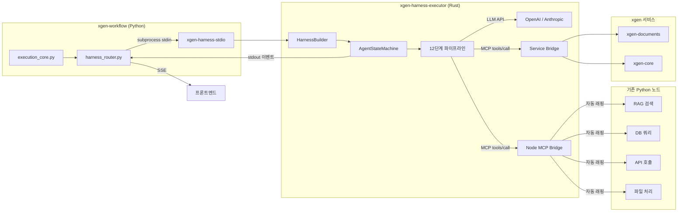
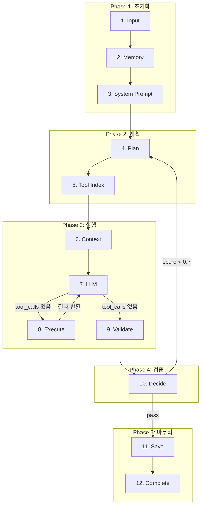
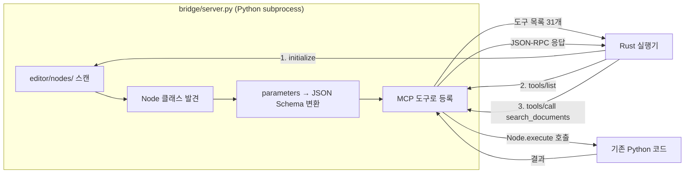

# xgen-harness-executor

Rust 상태 머신 기반 에이전트 실행기. Claude Code의 하네스 엔지니어링을 xgen 플랫폼에 이식했다.

기존 xgen-workflow의 Python DAG 실행기(`AsyncWorkflowExecutor`)는 노드를 순서대로 한 번 실행하고 끝난다. 하네스 실행기는 **LLM이 자율적으로 판단**하여 도구를 선택하고, 실행하고, 품질을 검증하고, 부족하면 재시도한다.

---

## 왜 필요한가

### 기존 DAG 실행기의 한계

```
사용자가 노드를 A → B → C로 연결 → 그 순서대로만 실행
```

- 실행 순서가 고정 — LLM이 상황에 따라 다른 도구를 쓸 수 없음
- 검증 없음 — 에이전트가 틀린 답을 해도 그냥 넘어감
- 재시도 불가 — `for` 루프라서 뒤로 돌아갈 수 없음
- context window 관리 없음 — 대화가 길어지면 터짐

### 하네스 실행기의 접근

```
사용자 질문 → LLM이 스스로 판단 → 필요한 도구 선택 → 실행 → 검증 → 부족하면 재시도
```

- **while 루프** 기반 상태 머신 — 어떤 단계로든 점프 가능
- 독립 평가 LLM이 품질 채점 → 기준 미달 시 자동 재시도
- 기존 Python 노드 60+개를 MCP 도구로 자동 변환 → LLM이 자유롭게 호출
- context window 자동 관리 (토큰 초과 시 3단계 압축)

---

## 전체 아키텍처



### 통신 방식

```
Python (asyncio)                      Rust (tokio)
────────────────                      ────────────
proc = create_subprocess_exec(
  "xgen-harness-stdio",
  stdin=PIPE, stdout=PIPE)

stdin.write(JSON-RPC) ──────→         stdin 한 줄 읽기
stdin.close()                         → HarnessBuilder
                                      → AgentStateMachine.run()
                                      → 12단계 파이프라인 실행

  ←── stdout (라인별)     {"method":"harness/event",...}  실시간 이벤트
  ←── stdout (라인별)     {"method":"harness/event",...}
  ←── stdout (마지막)     {"id":1,"result":{"text":"..."}}  최종 결과
```

**subprocess + stdio** — HTTP 서버가 아닌 라이브러리로 동작. 프로세스 격리 + 비용 0.

---

## 12단계 파이프라인



### 각 단계 설명

| # | 단계 | 모듈 | 역할 | 필수 |
|---|------|------|------|:----:|
| 1 | **Input** | `bootstrap.rs` | API 키 확인, provider/model 유효성 검증 | O |
| 2 | **Memory** | `memory_read.rs` | 이전 실행 결과에서 키워드 매칭으로 관련 내용 프리페치 | |
| 3 | **System Prompt** | `context_build.rs` | 5개 섹션 자동 조립: 역할 + 도구지침 + 톤 + 출력효율 + 환경정보. 에이전트에 설정된 시스템 프롬프트가 있으면 그걸 base로 사용 | O |
| 4 | **Plan** | `plan.rs` | LLM에게 스프린트 계약 요청: 목표, 필요정보, 검색전략, 완료기준. Validate의 채점 기준이 됨 | |
| 5 | **Tool Index** | `tool_discovery.rs` | MCP `tools/list`로 사용 가능한 도구 탐색 → 시스템 프롬프트에 "사용 가능한 도구" 섹션 주입. LLM이 이 목록을 보고 어떤 도구를 쓸지 판단 | |
| 6 | **Context** | `context_compact.rs` | 토큰 버짓 체크 + 3단계 자동 압축: History Snip → RAG 축소 → LLM 요약 | |
| 7 | **LLM** | `llm_call.rs` | LLM API SSE 스트리밍 호출. tool_calls 응답이면 Execute로 점프. 지수 백오프, 모델 폴백 포함 | O |
| 8 | **Execute** | `tool_execute.rs` | MCP 도구 실행. Read 도구=병렬, Write 도구=직렬. 완료 후 LLM으로 복귀 (루프, 최대 20회) | |
| 9 | **Validate** | `validate.rs` | **독립 평가 LLM**이 관련성(0.3) + 완전성(0.3) + 정확성(0.2) + 계약준수(0.2) 채점 | |
| 10 | **Decide** | `decide.rs` | 점수 < threshold(0.7) → Plan으로 재시도 (최대 3회) | |
| 11 | **Save** | `memory_write.rs` | PostgreSQL `harness_execution_log` 테이블에 실행 결과 저장 | |
| 12 | **Complete** | (내장) | 최종 출력 반환, 메트릭 수집 (duration_ms, total_tokens, cost_usd) | O |

### 프리셋

| 프리셋 | 단계 수 | 용도 |
|--------|:-------:|------|
| `minimal` | 4 | 단순 대화 (Input → System Prompt → LLM → Complete) |
| `standard` | 7 | 계획 + 도구 사용 |
| `full` | 12 | 전체 (검증/재시도/DB 저장 포함) |

### 자동 바이패스

입력 복잡도를 규칙 기반(0ms, LLM 호출 없음)으로 판별하여 불필요한 단계를 자동 스킵:

| 입력 | 분류 | 결과 |
|------|------|------|
| "안녕" | Simple | full → minimal (4단계) |
| "코드 작성해줘" | Moderate | full → standard (7단계) |
| "RAG 검색 후 비교 보고서" | Complex | 유지 (12단계) |

---

## 기존 노드를 MCP로 감싸는 이유

### 문제

기존 xgen-workflow에는 60+개 Python 노드가 있다 (RAG 검색, DB 쿼리, API 호출, Slack 전송 등). 이 노드들은 DAG 실행기에서만 쓸 수 있고, LLM이 직접 호출할 수 없다.

### 해결: Node MCP Bridge

`bridge/server.py`가 기존 Python 노드를 **MCP 도구로 자동 변환**한다:



**핵심: 기존 노드 코드 변경 0.**

1. Rust 실행기가 `bridge/server.py`를 subprocess로 spawn
2. Bridge가 `editor/nodes/` 디렉토리를 스캔하여 모든 Node 클래스를 발견
3. 각 노드의 `parameters`를 JSON Schema로 변환하여 MCP 도구로 등록
4. LLM이 `tools/call`로 도구를 호출하면 Bridge가 `Node.execute()`를 실행
5. 결과를 JSON-RPC로 Rust에 반환

### 제외되는 노드

하네스가 직접 처리하는 기능은 MCP 도구화하지 않음:

| 제외 대상 | 이유 |
|-----------|------|
| `agents/*` | 하네스 자체가 에이전트 |
| `startnode/*`, `endnode/*` | 하네스가 입출력 처리 |
| `router/*` | 하네스가 흐름 제어 |
| `tools/agent_planner` | 하네스 Plan 단계가 대체 |

### Service Tools Bridge

`bridge/service_tools.py`는 xgen 서비스 간 API를 MCP 도구로 노출:

| 도구 | 설명 |
|------|------|
| `search_documents` | xgen-documents 벡터 검색 |
| `list_collections` | 컬렉션 목록 조회 |
| `search_in_collection` | 특정 컬렉션 검색 |

---

## Claude Code에서 가져온 것

| Claude Code 개념 | 하네스 구현 | 출처 |
|------------------|------------|------|
| query.ts 메인 루프 | 12단계 상태 머신 (`agent_executor.rs`) | 직접 포팅 |
| 7가지 continue 경로 | `recover.rs` — 에러 복구 7패턴→5액션 | query.ts continue 분기 |
| 시스템 프롬프트 조립 | `context_build.rs` — 5개 섹션 자동 빌드 | 프롬프트 엔지니어링 |
| 도구 호출 루프 | LLMCall ↔ ToolExecute 루프 (최대 20회) | agentic loop |
| 컨텍스트 압축 | `context_compact.rs` — 3단계 자동 압축 | context window 관리 |
| MCP 도구 사용 | `tool_discovery.rs` + Bridge 자동 주입 | MCP 프로토콜 |

### 추가한 것 (Anthropic 하네스 엔지니어링)

| 기능 | 설명 |
|------|------|
| 스프린트 계약 | Plan 단계에서 목표/전략/완료기준 선언 → Validate에서 준수 여부 채점 |
| 독립 평가 게이트 | 실행 LLM과 분리된 평가 LLM이 4가지 기준으로 채점 |
| 자동 재시도 | 점수 미달 시 Plan으로 돌아가서 재시도 (최대 3회) |
| 입력 복잡도 분류 | 규칙 기반(0ms)으로 판별하여 파이프라인 자동 최적화 |

---

## 에러 복구 (`recover.rs`)

Claude Code `query.ts`의 7가지 continue 경로를 포팅:

| 에러 | 복구 |
|------|------|
| 413 context_length_exceeded | **Compact** — 히스토리 압축 (최근 4개 유지) |
| max_tokens 초과 | **Escalate** — 8K → 64K 에스컬레이션 |
| 429 rate limit | **Fallback** — claude-sonnet → claude-haiku 모델 폴백 |
| 529 overloaded | **Retry** — 지수 백오프 (1s/2s/4s) |
| timeout | **Retry** — 즉시 재시도 |
| 도구 에러 | LLM에 에러 전달하여 다른 도구 시도 |
| 3회 연속 실패 | **GiveUp** — 에러 전파 |

---

## 사용 모드

### 1. stdio CLI (기본, 권장)

xgen-workflow에서 subprocess로 호출:

```bash
cargo build --release --bin xgen-harness-stdio -j 2
```

### 2. Rust 라이브러리

```rust
use xgen_harness_executor::prelude::*;

let output = HarnessBuilder::new()
    .provider("anthropic", "claude-sonnet-4-6")
    .api_key("sk-...")
    .text("피보나치 함수를 작성해줘")
    .stages(["input", "system_prompt", "plan", "llm", "execute", "complete"])
    .run()
    .await?;
```

### 3. HTTP 서버

```bash
cargo build --release --features server --bin xgen-harness-executor
```

---

## Feature Flags

| Feature | 기본 | 설명 |
|---------|:----:|------|
| `core` | O | 상태 머신, LLM, MCP, Builder |
| `stdio` | O | stdin/stdout JSON-RPC CLI |
| `server` | - | HTTP 서버 (Axum, JWT) |

---

## JSON-RPC 프로토콜

### 요청 (stdin)

```json
{
  "jsonrpc": "2.0",
  "id": 1,
  "method": "harness/run",
  "params": {
    "text": "CSV 데이터 분석해줘",
    "provider": "openai",
    "model": "gpt-4o-mini",
    "api_key": "sk-...",
    "system_prompt": "너는 데이터 분석가야",
    "harness_pipeline": "full",
    "tools": ["mcp://bridge/nodes", "mcp://bridge/services"],
    "temperature": 0.7
  }
}
```

### 이벤트 (stdout, 라인별)

| event | 설명 |
|-------|------|
| `stage_enter` | 단계 시작 (stage_id, stage_ko, step/total) |
| `stage_exit` | 단계 완료 (output, score) |
| `message` | LLM 텍스트 스트리밍 |
| `tool_call` | MCP 도구 호출 |
| `tool_result` | 도구 실행 결과 |
| `evaluation` | 품질 채점 (score 0~1) |
| `metrics` | 실행 메트릭 (duration_ms, tokens, cost) |

---

## 빌드

```bash
cargo build --release --bin xgen-harness-stdio -j 2
```

릴리스 프로파일:
```toml
[profile.release]
codegen-units = 16   # 빌드 메모리 절감
lto = "thin"         # 링크 최적화 (메모리 효율)
opt-level = "z"      # 바이너리 크기 최소화
```

> Docker 안에서 빌드하지 않는다. `lto=true` + `codegen-units=1`은 LTO 단계에서 4~8GB 메모리를 먹어 OOM을 유발한다. 로컬/CI에서 빌드 후 바이너리만 COPY.

---

## 환경 변수

| 변수 | 기본값 | 설명 |
|------|--------|------|
| `ANTHROPIC_API_KEY` | - | Anthropic API 키 |
| `OPENAI_API_KEY` | - | OpenAI API 키 |
| `DATABASE_URL` | - | PostgreSQL (실행 로그 저장, 없으면 스킵) |
| `NODE_BRIDGE_SCRIPT` | `bridge/server.py` | Node MCP Bridge 스크립트 |
| `NODE_BRIDGE_NODES_DIR` | - | Python 노드 디렉토리 (`editor/nodes/`) |
| `SERVICE_BRIDGE_SCRIPT` | `bridge/service_tools.py` | Service Tools Bridge |
| `MCP_STATION_URL` | `http://xgen-mcp-station:8000` | MCP 스테이션 |

---

## License

MIT
